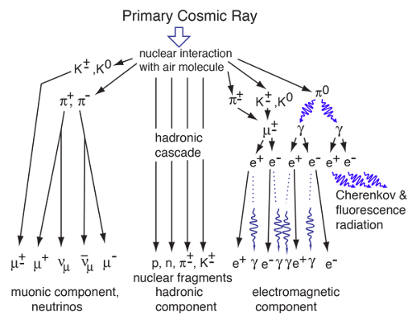
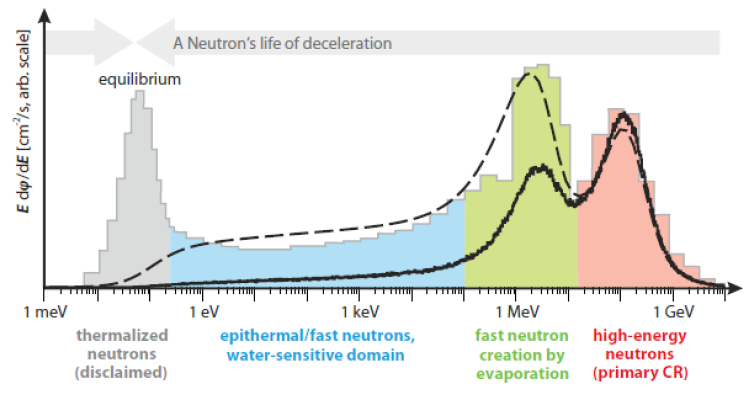
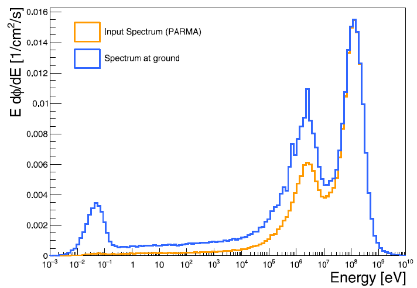
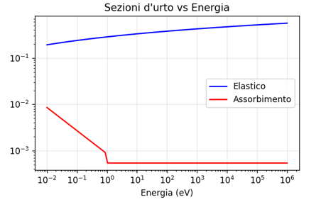
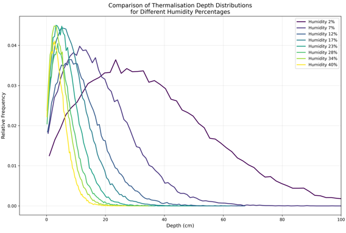
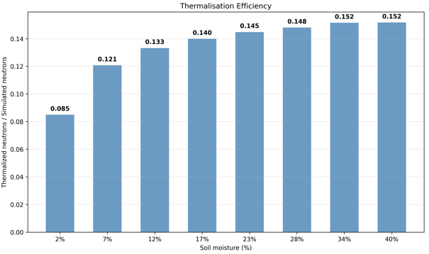
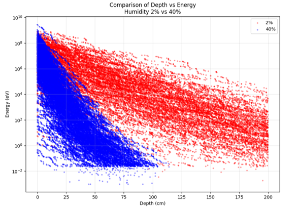
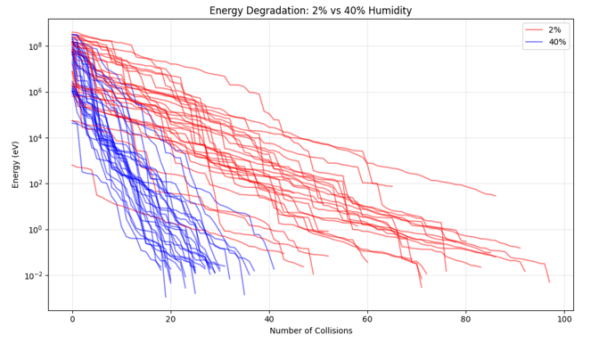

# 🛰️ Neutron Thermalization Simulator

This model was developed as part of my **Bachelor’s thesis in Mechanical Engineering** to study neutron moderation in soil and its dependence on **water content**, with applications in **water leak detection**.

This project implements a **history-based Monte Carlo neutron transport model** to simulate how cosmic-ray neutrons interact with soil and progressively lose energy through scattering until thermalization, absorption, or escape.

---

# Overview

Cosmic rays are extremely high-energy particles originating mainly from supernova explosions and other celestial bodies. During their journey through interstellar space, unstable particles decay; for this reason, protons are the particles that most frequently reach the Earth's atmosphere. When they enter the Earth's atmosphere with energies of the order of GeV, they interact with nitrogen and oxygen nuclei, generating cascades of particles, i.e. secondary cosmic rays consisting mainly of protons, muons and neutrons.

<p align="center">
  
</p>
<p align="center">
 <i>Secondary cosmic radiation formation scheme.</i>
</p>

Neutrons undergo successive interactions with the atmosphere, which progressively reduces their energy, giving rise to different energy bands: high-energy, fast, epithermal and thermal neutrons.

<p align="center">
  
</p>
<p align="center">
 <i>Neutron energy spectra at the surface: exemplary measurement by Goldhagen et al. [2002] (grey) and simulated by Sato and Niita [2006].</i>
</p>

The neutron population detected above the ground strongly depends on:

- soil moisture
- soil chemical composition
- density
- porosity

The purpose of this simulator is to model this **moderation process** using a particle-by-particle Monte Carlo approach.

---

# Simulation Model

The simulator tracks each neutron individually from its generation to its final state.

## Neutron generation

Each neutron is generated with:

- energy sampled from the **PARMA spectrum** stored in `SpectrumCurrent.csv`
- an **isotropic direction** in the upper hemisphere
- an initial position at the soil surface

<p align="center">
  
</p>
<p align="center">
 <i>Differential flux as a function of the neutron energy. The orange line denotes the input flux in the simulations, as obtained from the PARMA model, whereas the blue line indicates the flux measured at the detector position, which also includes the albedo component.</i>
</p>

## Transport in soil

The neutron propagates through the soil medium where its motion is governed by stochastic interactions.

The soil can be characterized by parameters such as:

- density
- porosity
- water content
- elemental composition

## Neutron interactions

The interactions considered are **elastic scattering** and **absorption**. Each process is associated with a probability that depends on the neutron energy and the cross section of the element involved. The cross section curves used and shown in the figure are based on experimental data available in the literature.

<p align="center">
  
</p>
Each collision updates:

- neutron energy
- neutron direction
- neutron position
- number of collisions

## Termination conditions

The neutron history stops when one of the following conditions occurs:

- **thermalization**
- **absorption**
- **backscattering**

---

# Installation

Clone the repository:

```bash
git clone https://github.com/M4x000/Neutron-Thermalization-Simulator.git
cd Neutron-Thermalization-Simulator
```

Install dependencies:

```bash
pip install -r requirements.txt
```

---

# Usage

Run the simulator with:

```bash
python neutron_simulator.py
```

Simulation parameters such as:

- number of neutrons
- soil properties
- interaction parameters

can be modified directly in the script.

---

# Applications

This simulator can be used for:

- studying **neutron moderation in soil**
- investigating the impact of **soil moisture on neutron transport**
- supporting research on **cosmic-ray neutron sensing**

---

# Example Results

Here are some example outputs generated by the model:
<p align="center">
  
  
</p>

<p align="center">
  
  
</p>
